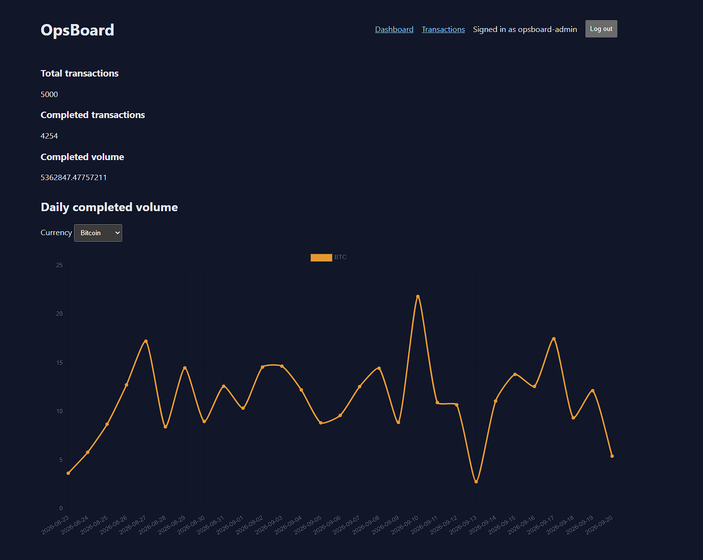
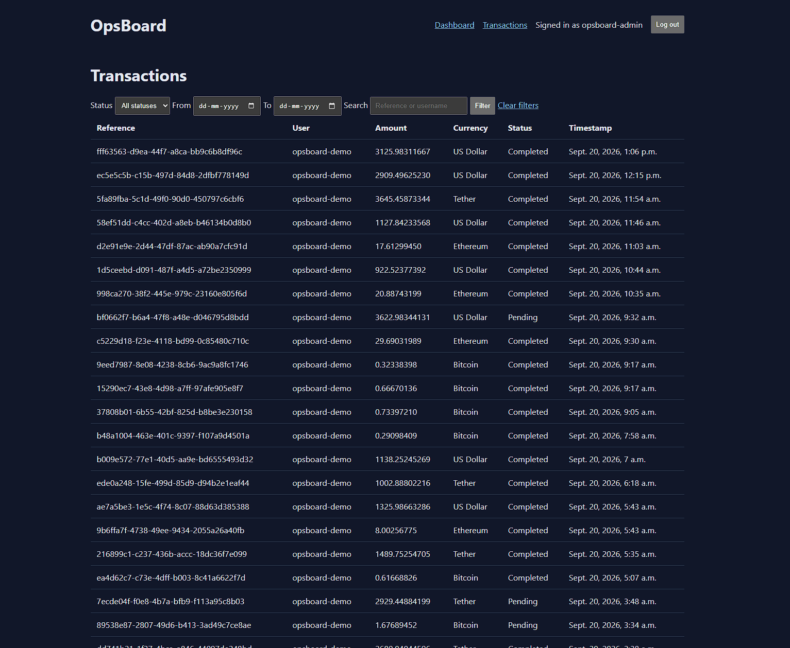
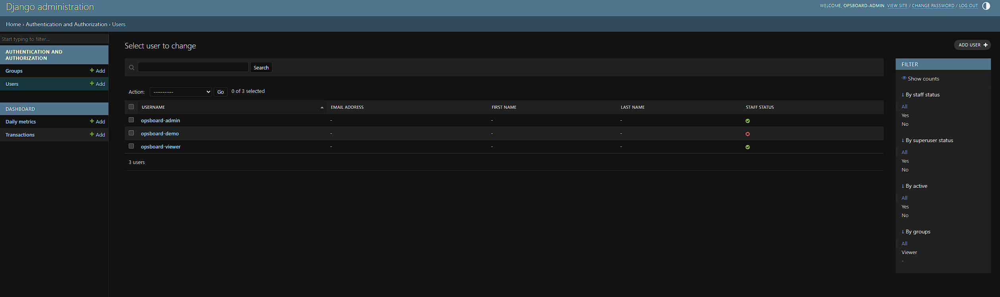

# OpsBoard

An internal transaction metrics dashboard built with Python and Django. OpsBoard models a small operations tool for inspecting transaction activity, reviewing daily rollups, and giving administrators and view-only staff appropriately scoped access.

**Production-flavored Django project drawing on 7+ years of production Unity/C# experience.**

[Live demo](https://opsboard-logan-ak47.onrender.com/) · [JSON chart endpoint](https://opsboard-logan-ak47.onrender.com/api/charts/daily-volume/)

> The Render free service can take about a minute to wake after 15 minutes of inactivity.

## Demo login

```text
Username: opsboard-viewer
Password: OpsBoard-Viewer-2026!
```

This deliberately public account can inspect the dashboard and Django admin data but cannot add, change, or delete records. All deployed transaction data is generated and fictional. Administrator credentials remain private.

## Screenshots

### Metrics dashboard



### Filterable transaction list



### View-only Django admin



## Features

- Django session authentication with administrator and view-only roles
- Transaction model with UUID references, exact decimal amounts, currencies, statuses, timestamps, and user ownership
- Precomputed daily metric rollups for reporting reads
- Management command that generates 5,000 realistic transactions efficiently
- Filterable, searchable, paginated transaction list
- Summary cards calculated with one conditional aggregate query
- Chart.js daily-volume visualization with a currency selector
- Authenticated `JsonResponse` endpoint supplying chart data
- Configured Django admin with columns, filters, search, date navigation, and efficient relationship loading
- Idempotent production bootstrap for users, groups, and permissions
- Sixteen automated tests covering views, queries, permissions, seeding, authentication, and deployment bootstrap behavior

## Architecture

OpsBoard uses Django's server-rendered Model-View-Template architecture. It intentionally avoids a SPA or separate API framework because this internal dashboard only needs one small JSON contract.

```text
Browser
  ├─ HTML request ──> middleware ──> URL resolver ──> Django view
  │                                             └──> template response
  └─ chart fetch ──> authenticated JSON view ──> DailyMetric rollups

Django ORM ──> SQLite locally / PostgreSQL on Render
```

### Data model

- `Transaction` is the source-of-truth event record.
- `DailyMetric` is a deliberate denormalized rollup keyed by date and currency.
- Django's built-in `User`, `Group`, and `Permission` models provide identity and authorization.

Financial values use `DecimalField`, not floating point. The transaction table indexes timestamps and the combined status/timestamp filter path. Foreign-key users are loaded with `select_related()` on list reads to avoid N+1 queries.

### Why plain Django JSON instead of DRF?

The application exposes one fixed, read-only chart payload. `JsonResponse` keeps that contract explicit without introducing serializers, routers, or viewsets. Django REST Framework would become appropriate if the API grew into multiple resources, write operations, versioning, or third-party consumers.

## Local setup

Prerequisites:

- Python 3.13
- [uv](https://docs.astral.sh/uv/)

Clone and initialize the project:

```powershell
git clone https://github.com/Logan-ak47/Dashboard.git
cd Dashboard
uv sync --frozen
uv run python manage.py migrate
```

Create local admin and viewer accounts with development-only passwords:

```powershell
$env:OPSBOARD_ADMIN_PASSWORD = "choose-a-local-admin-password"
$env:OPSBOARD_VIEWER_PASSWORD = "choose-a-local-viewer-password"

uv run python manage.py bootstrap_users

Remove-Item Env:OPSBOARD_ADMIN_PASSWORD
Remove-Item Env:OPSBOARD_VIEWER_PASSWORD
```

Generate demo data and start Django:

```powershell
uv run python manage.py seed_data --count 5000 --clear
uv run python manage.py runserver
```

Open <http://127.0.0.1:8000/>.

## Useful commands

```powershell
# Validate Django configuration
uv run python manage.py check

# Run the complete test suite
uv run python manage.py test

# Generate a smaller dataset
uv run python manage.py seed_data --count 100 --clear

# Gather production static assets
uv run python manage.py collectstatic --noinput
```

## JSON endpoint

Authenticated users can request:

```text
GET /api/charts/daily-volume/
```

The response contains aligned date labels and one zero-filled dataset per currency:

```json
{
  "labels": ["2026-09-01", "2026-09-02"],
  "datasets": [
    {
      "label": "BTC",
      "data": [0, 1.25]
    }
  ]
}
```

## Deployment

The root `render.yaml` defines:

- a Render Python web service running Gunicorn;
- a managed PostgreSQL database;
- frozen dependency installation with `uv`;
- static collection and WhiteNoise serving;
- migrations, idempotent account bootstrap, and demo-data generation;
- generated and manually supplied environment secrets;
- an authentication-page health check.

Production settings fail closed if `DJANGO_SECRET_KEY` is absent, use secure session/CSRF cookies, redirect HTTP to HTTPS, and trust Render's forwarded HTTPS header.

### Free-tier limitations

- The web service sleeps after 15 idle minutes and cold starts can take about one minute.
- Render's free PostgreSQL database expires after 30 days and has no backups.
- The demo dataset is deliberately recreated during deployment.

These constraints are appropriate for a portfolio demonstration, not a real production system.

## Engineering decisions

- Kept Django's built-in user model instead of creating unnecessary identity infrastructure.
- Used database constraints and indexes for integrity and common filter paths.
- Used `bulk_create()` for seed throughput and SQL aggregation for rollups.
- Wrapped seed/bootstrap writes in transactions so partial work rolls back on failure.
- Preserved filter query parameters across pagination.
- Used named URLs throughout templates and tests to avoid coupling callers to concrete paths.
- Used a shared base template and namespaced static files instead of duplicating page structure.
- Kept React, Docker, Celery, websockets, DRF viewsets, custom users, and microservices out of the deliberately small v1 scope.

## License

This project is provided as a portfolio project.